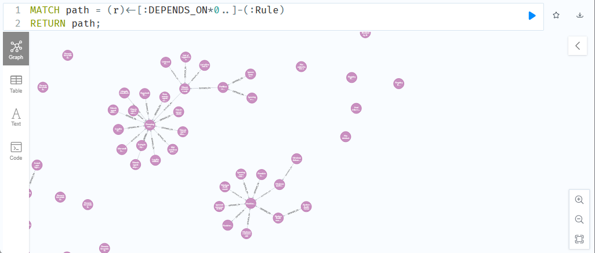
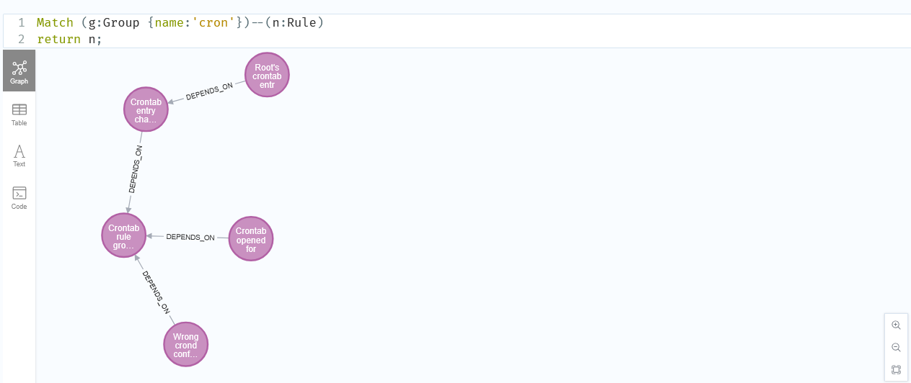
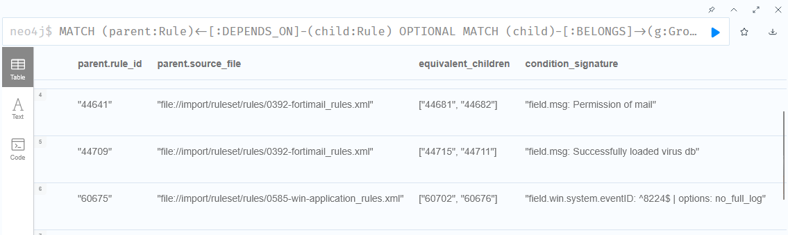

# Wazuh4j
This repository contains everything necessary for importing, visualizing and analysing wazuh rule sets. This includes importing wazuh's default rule set as well as your own wazuh rule sets to see how they work *together*. 

## Neo4j
The engine of this project is neo4j. It is a graph database perfectly tailored to this problem. 
More information about it can be found here: https://medium.com/@balajeraam/neo4j-for-beginners-a8e5a64b074a

If you want to dive into the cypher query language: https://neo4j.com/docs/cypher-manual/current/introduction/


## TLDR: How to use
>[!NOTE] 
> Detailed instructions can be found further down. <br> All mentioned queries and much more can be found [here](Queries.md).

**Import wazuh rule sets** into the neo4j database with `load.py`.
```
Usage: load.py [OPTIONS]

Options:
  -x, --xml-folders PATH    Folder path of xml files containing Wazuh rules.
                            It must not be an absolute path or contain
                            backtracking elements.
  -o, --ossec-configs PATH  Path to an ossec.conf file to exclude rules.
  --help                    Show this message and exit.                 
```

**Explore the visualization** of your imported wazuh rule sets at http://localhost:7474.
- Get a tree-like visualization of your rules: ```MATCH path = (r)<-[:DEPENDS_ON*0..]-(:Rule) RETURN path;```
    
- Get all rules of a group: ```MATCH (g:Group {name:'my_rule_name'})--(n:Rule) return n;```
    

- Get all rules that have a parent specified but this parent rule does not exist: <br>```MATCH (child:Rule) WHERE child.parents IS NOT NULL UNWIND child.parents AS parent WITH child, parent WHERE NOT EXISTS { MATCH (p:Rule {rule_id: parent})} RETURN DISTINCT child, parent as missing_parent```

- To ensure that there are no rule IDs in your custom wazuh rules overwriting other rules IDs, get all rules that have the same ID: <br>```MATCH (rule:Rule), (rule_duplicate:Rule) WHERE rule.rule_id = rule_duplicate.rule_id and not elementId(rule) = elementId(rule_duplicate) AND NOT (rule)-[:OVERWRITES]-(rule_duplicate) RETURN rule.rule_id, rule.source_file, rule_duplicate.source_file```

- Find competing sibling rules (rules of a parent that are triggered under the same conditions). Query can be found [here](Queries.md).
    


## How to install Wazuh4J

###  Clone the repository
```shell
git clone https://github.com/DigiFors/Wazuh4J
cd wazuh4j


###  Install docker 
Linux:
```shell
# install docker and docker compose
sudo apt install docker.io docker-compose-v2          # under windows run without "sudo"     
```

Windows: 
<br> Download from [docker website](https://docs.docker.com/desktop/install/windows-install/), complete installation and start Docker Desktop.

### Build and start the neo4j docker container
```shell
sudo docker compose up --build -d                   # under windows run without "sudo"
```

###  (Recommended) Create a Python virtual environment
Use a virtual environment to run Wazuh4J in instead of running it globally to avoid dependency conflicts.
```shell
python -m venv venv         # create virtual environment
```
Then activate/access your virtual environment:
- Under Linux: `source venv/bin/activate`
- Under Windows in cmd: `venv\Scripts\activate.bat`


###  Install Python dependencies
```
pip install -r requirements.txt
```

## How to use Wazuh4J
After installation, ensure that the neo4j docker container is up and running:
```shell
cd Wazuh4J          # go to project folder
sudo docker compose up   # start docker container (without "sudo" under windows)
sudo docker compose ps   # check if container is running (without "sudo" under windows)
```

###  Import the wazuh rule sets into Wazuh4J
First, prepare the wazuh rule sets for import 

> [!Warning]
> Place the rule folders in the current working directory and provide relative paths rather than providing the absolute path to the folder. 

Folder Structure - Example (The most recommended folder structure):
```
Wazuh4J
├── windows-rules                                         <---
│   ├── 110000_windows_kerberos_rules.xml
│   ├── 110050_windows_ldap_rules.xml
│   ├── 110100_windows_smb_rules.xml
├── docker-compose.yml
├── import
├── init.cipher
├── load.py
├── Queries.md
├── readme.md
├── requirements.txt
├── rules                                                 <---
│   ├── 100000_wazuh-default_override_rules.xml
│   ├── 100020_own_trendmicro-apexone_rules.xml
│   ├── 100050_own_cisco-asa_additional_rules.xml
├── soc-fortress                                          <---
│   ├── 107700_windows_plug-n-play_rules.xml
│   ├── 103400_windows_taskscheduler_rules.xml
│   ├── 103300_sophos-edr_integration_rules.xml
└── wazuh-rules                                           <---
│   ├── 100300_linux_clamav_rules.xml
│   ├── 102400_forticlient_rules.xml
│   ├── 102900_checkpoint-smart1.rules.xml
```

Second, load the wazuh rules grouped by origin into the current directory (inside the activated virtual environment):

```shell
# to see all available options, run this
python load.py --help

# import wazuh rules into neo4j database
python load.py -x path/to/folder/with/xml/files
```

- For multiple rulesets, just add `-x another/folder/path` for each folder. 
- If you want to specify rules excluded by ossec.conf, then add `-o path/to/ossec.conf` 

### Explore the visualized wazuh rules 
Visit http://localhost:7474 in your browser. Here your local neo4j server is running.<br>
If you're asked for credentials, choose the *no authentification* option.

**Start exploring using [*Queries.md*](Queries.md) to find the answers to... everything!!!**

Feel free to adjust the color and display text of the nodes by clicking on their label and selecting the color or a display name -> [see here](https://stackoverflow.com/questions/44674646/how-do-i-change-what-appears-on-a-node-in-neo4j).


